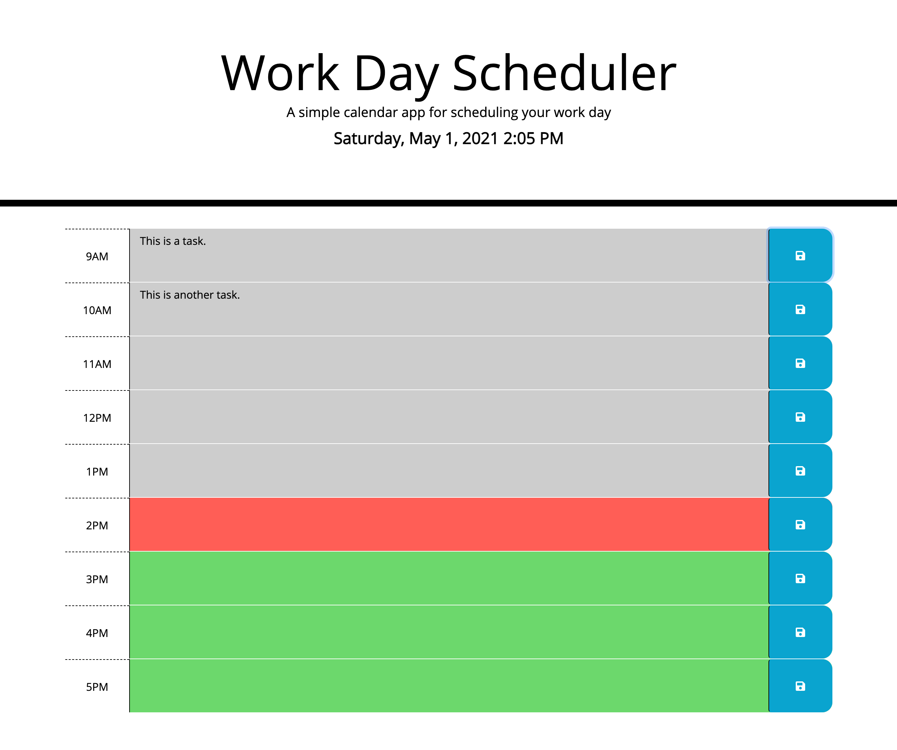

# 05_Work-Day-Scheduler
## Description

The objective for this project was to create a simple calendar application that would allow a user to save events for each hour of the work day. The required functionality included providing the ability to input event information and store it in the web browser so that it would be available upon refresh. In addition, business hours were expected to be color coded to represent which times were in the past, present, and future. The application features dynamically updated HTML and CSS using jQuery and the Moment.js library. The framework for the site was built using Bootstrap.

## Table of Contents

- [User Story](#user-story)
- [Acceptance Criteria](#acceptance-criteria)
- [Screenshot](#screenshot)
- [Deployed Application Link](#deployed-application-link)
- [Credits](#credits)
- [License](#license)

# User Story

```md
AS AN employee with a busy schedule
I WANT to add important events to a daily planner
SO THAT I can manage my time effectively
```

## Acceptance Criteria

```md
GIVEN I am using a daily planner to create a schedule
WHEN I open the planner
THEN the current day is displayed at the top of the calendar
WHEN I scroll down
THEN I am presented with timeblocks for standard business hours
WHEN I view the timeblocks for that day
THEN each timeblock is color coded to indicate whether it is in the past, present, or future
WHEN I click into a timeblock
THEN I can enter an event
WHEN I click the save button for that timeblock
THEN the text for that event is saved in local storage
WHEN I refresh the page
THEN the saved events persist
```

## Screenshot
This is a screenshot demonstrating the application in action:




## Deployed Application Link

This is a link to the deployed application: https://jamesljenks.github.io/05_Work-Day-Scheduler/

## Credits
- Trilogy Education Services, LLC: https://www.trilogyed.com/ 
- Bootstrap: https://getbootstrap.com/
- jQuery: https://api.jquery.com/
- Moment.js: https://momentjs.com/ 
- W3 Schools: https://www.w3schools.com/
- MDN Web Docs: https://developer.mozilla.org/en-US

## License

This project was created by James L. Jenks as part of the curriculum for the MSU Coding Boot Camp and Trilogy Education Services.

© 2021 Trilogy Education Services, LLC, a 2U, Inc. brand. Confidential and Proprietary. All Rights Reserved.
    